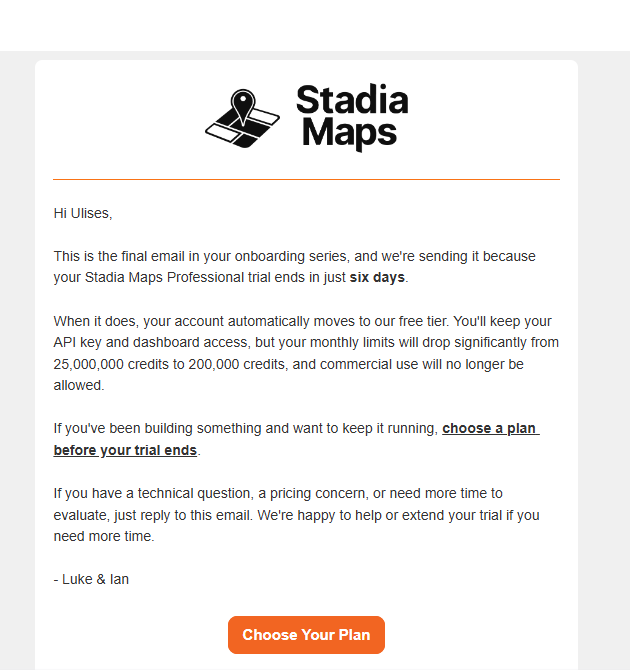

- hacer checkeos a vista y manuales de todo de la jam : sobretodo de fechas (
  que fechas se gaaurdan, cuales se borra, el cron job , como se filtra y busca
  , si cambio edit una jam de manual a weekly que pasa...se guardaan fechas
  anteriores o se sustituye todo... ? cuando deleto una jam que pasa ?)

  ## done

---

---

grupos faceboook, grupos reddit(de ciudades), boca a boca

"La regla en todos: publicá el valor, no el producto. "He mapeado todas las jam
sessions de Madrid" funciona. "Mirad mi app" te ganas un baneo."

